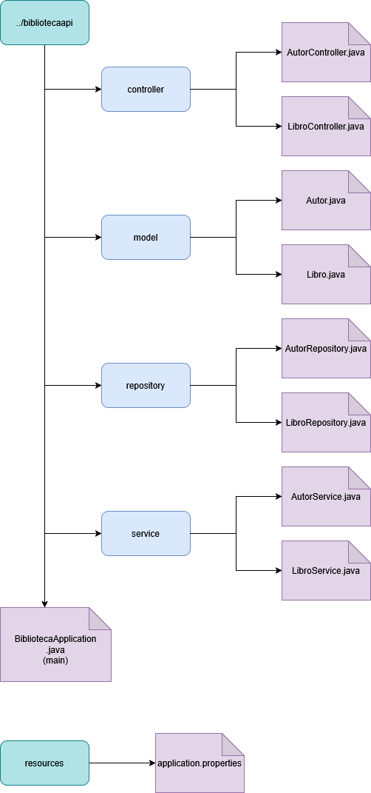
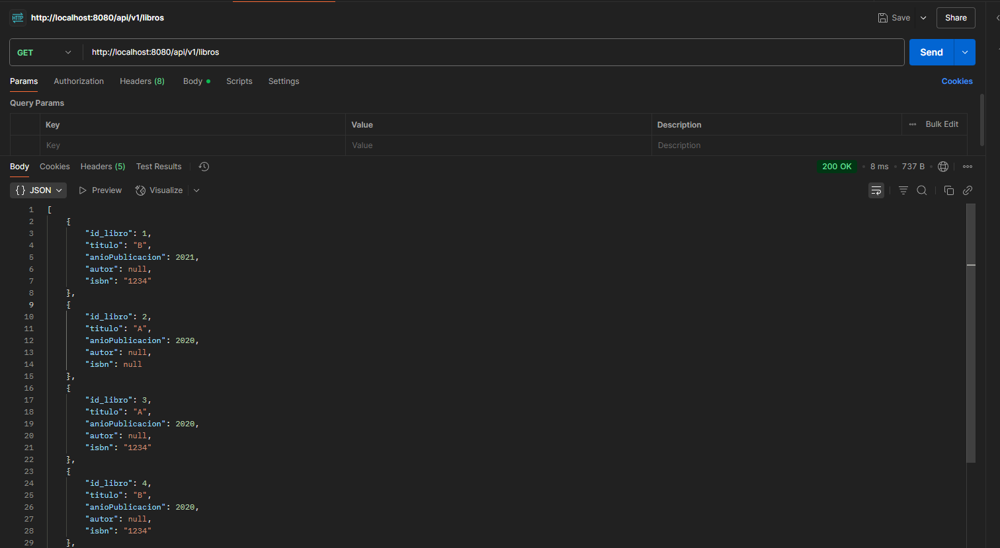
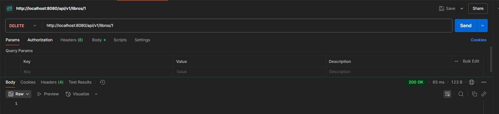
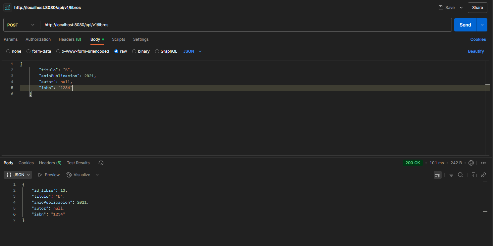
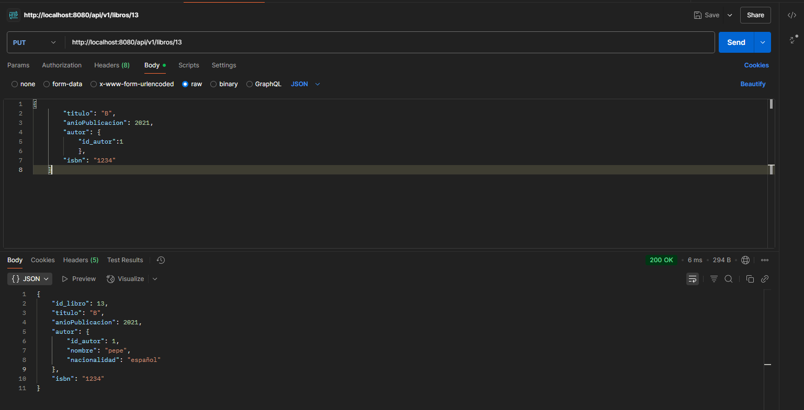
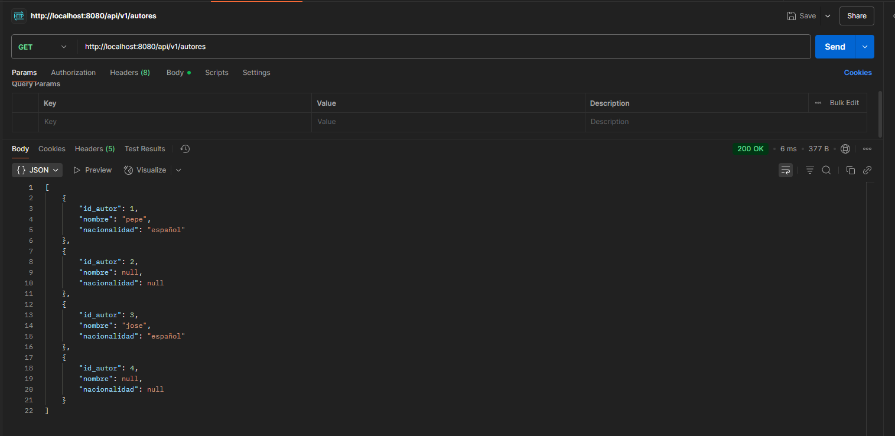
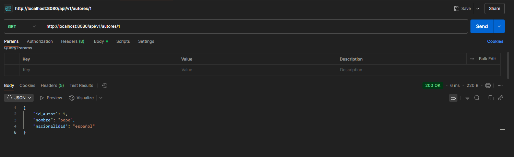
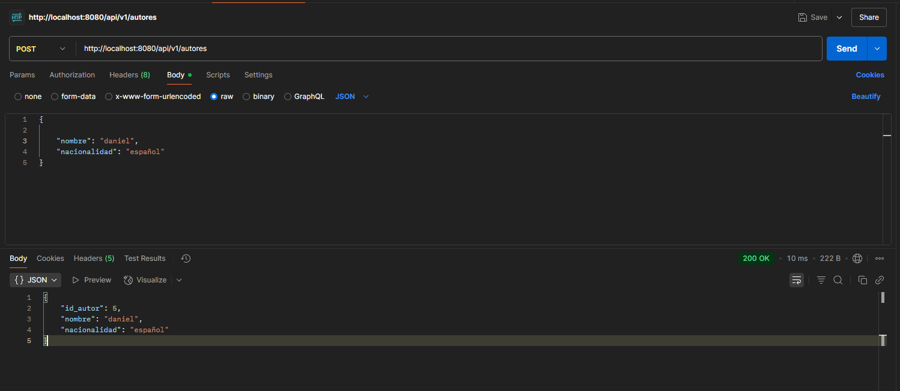

# Act2.Ens-Apr-Actividad-avanzada-API-REST-de-Libros-y-Autores
Aplicar relaciones entre entidades, búsquedas y ordenación en Spring Boot. 

# Herramientas utilizadas

     - Visual Studio Code
     - PostMan
     - SpringBoot

    
# Requisitos para su uso

    - Visual Studio Code
    - SpringBoot
    - Postman

# Estructura de carpetas
La aplicación se encuentra dentro de 

## biblioteca/src/main/java/com/tuapp/bibliotecaapi

Dentro están los siguientes paquetes:

# Controller
Paquete que contiene las clases AutorController.java y LibroController.java
# Model
Paquete que con los datos de las entidades Autor y Libro. Contiene Autor.java y libro.java
# Repository
Interfaz para acceder a la base de datos. Contiene AutoRepository.java y LibroRepository.java
# Service
Capa intermedia entre la API y los datos. Contiene AutorService.java y LibroService.java

# Demostración de funcionalidades

## Apartado de libros

### GET	/api/v1/libros	Listar todos los libros
Lista todos los libros de la base de datos

### GET	/api/v1/libros/{id}	Obtener libro por ID
Muestra el libro con la ID que le pasamos

### POST	/api/v1/libros	Crear nuevo libro (vincular a autor)
Crea un nuevo libro al que vinculamos un autor (Requiere haber creado el autor previamente)

### PUT	/api/v1/libros/{id}	Actualizar libro
Actualiza un libro existente

### DELETE	/api/v1/libros/{id}	Eliminar libro
Elimina un libro en base a su ID

### GET	/api/v1/libros/buscar	Buscar con filtros y ordenación
Busca un libro con filtro y ordenacion

## Apartado de autores

### GET	/api/v1/autores	Listar autores
Lista a los autores

### GET	/api/v1/autores/{id}	Ver autor con sus libros
Muestra a los autores y sus libros

### POST	/api/v1/autores	Crear nuevo autor
Crea un nuevo autor

## Reparto de tareas:  
Daniel: Clases relacionadas con Libros  
Jose: Clases relacionadas con Autores (Nota la variable "id" debe ser "id_autor")

Enlace a guia:
https://www.arquitecturajava.com/jpa-manytoone/ 

Cosas a solucionar: al intentar vincular autor y libro se genera un bucle infinito. Por algun motivo se vincula el libro al array del autor asignado
